# BudgetFlow

A Flutter-based budgeting app for real-time money control. Track income, manage fixed expenses, allocate budgets, and update spending instantly. Offline-first, simple, and designed to help users make smarter financial decisions daily.

---

## 🚀 Overview

Most budgeting apps focus on tracking history.

**BudgetFlow focuses on control.**

Users:
- Add income
- Subtract fixed expenses
- Allocate remaining money into categories
- Track spending in real time
- Adjust budgets instantly

Everything updates live, so users always know exactly where they stand.

---

## ✨ Key Features

### 💵 Income Management
- Add multiple income sources (salary, freelance, etc.)
- Automatically calculates total monthly income

### 🧾 Fixed Expenses
- Track recurring costs (rent, transport, WiFi, etc.)
- Automatically deducted from income

### 📂 Budget Categories
- Create custom categories (Food, Savings, Clothes, etc.)
- Allocate budget by **amount or percentage**

### ⚡ Real-Time Spending (Core Feature)
- Add spending instantly
- Add funds when needed
- Category balances update live

### 🚨 Overspending Alerts
- Visual indicators when a category exceeds its budget
- Dashboard warnings for better awareness

### 🎯 Savings Goals
- Set financial goals
- Track progress with visual indicators

### 📜 Transaction History
- View all spending and adjustments
- Search and filter transactions

### 🔄 Monthly Reset
- Reset spending for a new month
- Keep structure (categories, income, expenses)

### 🔒 Offline First
- No account required
- No internet needed
- Data stored locally on device

---

## 🧠 Why This App?

BudgetFlow solves a real problem:

> People don't just need to track money — they need to **control it in real time**.

Instead of asking:
> "Where did my money go?"

Users can now ask:
> "If I spend this now, what happens next?"

---

## 🛠️ Tech Stack

- **Flutter** (UI framework)
- **Dart**
- **Provider** (state management)
- **SharedPreferences / Local Storage**
- **Material Design**

---

## 📱 Screenshots

### Dashboard
<p float="left">
  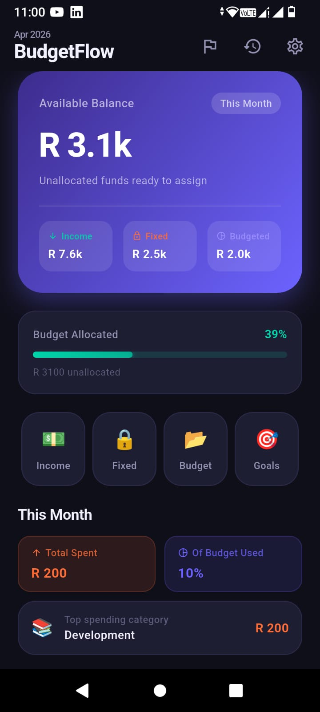
  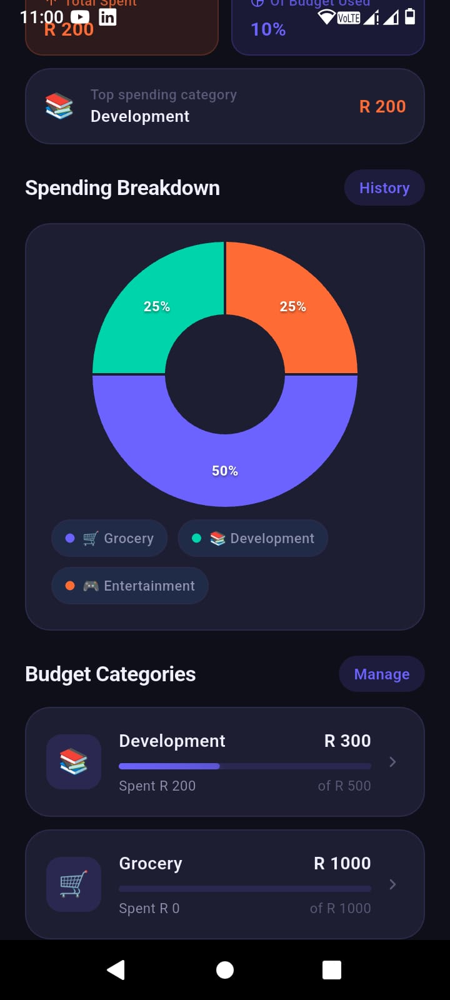
</p>

### Income
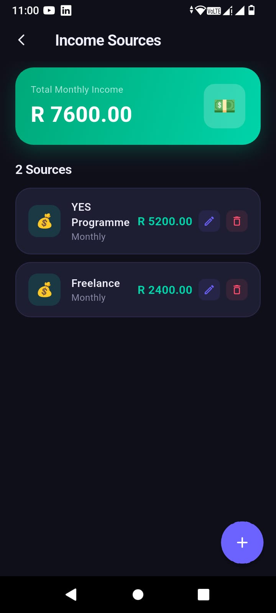

### Fixed Expenses
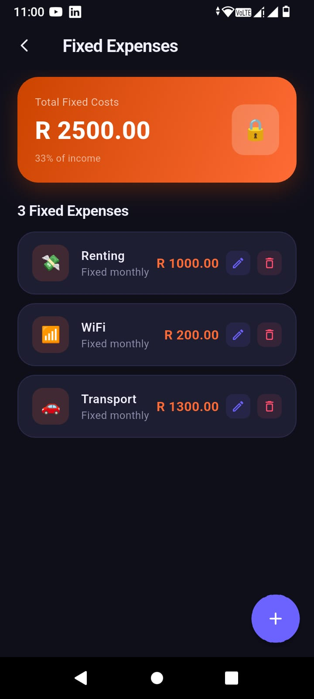

### Budget Allocation
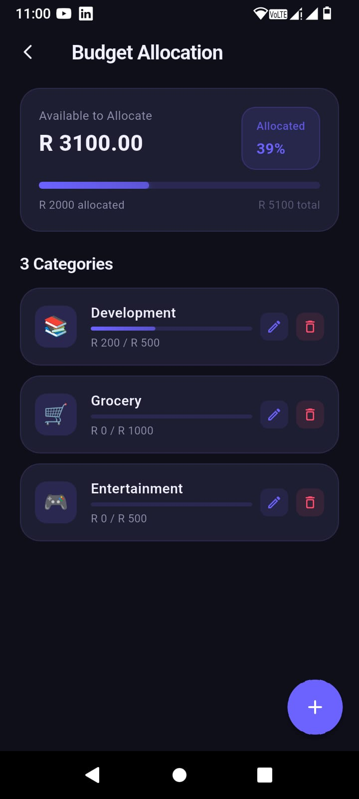

### Categories Overview
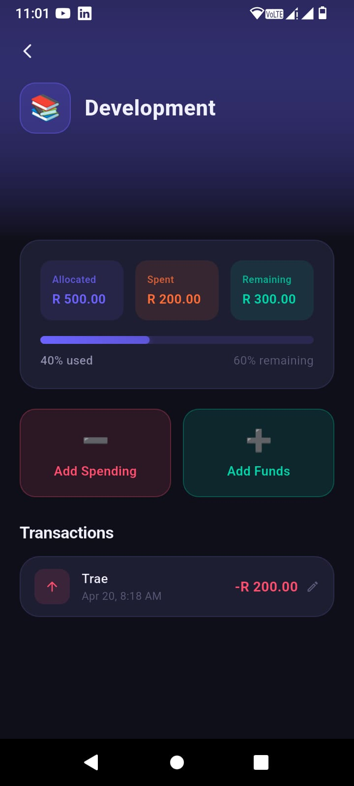

### Spending
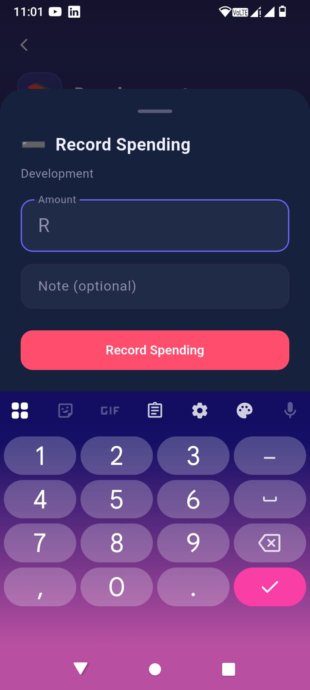

### Adding Funds
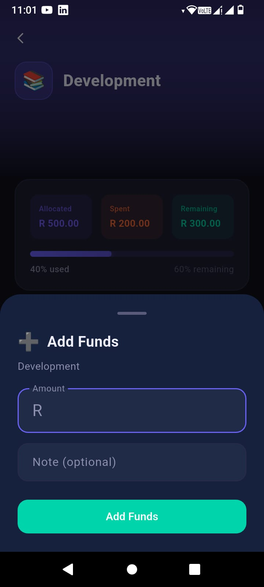

### Transaction History
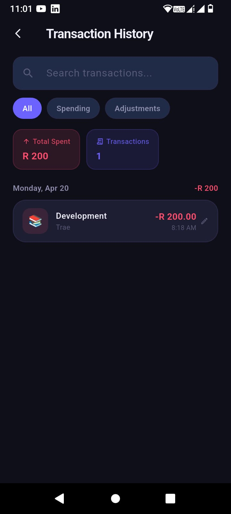

### Savings Goals
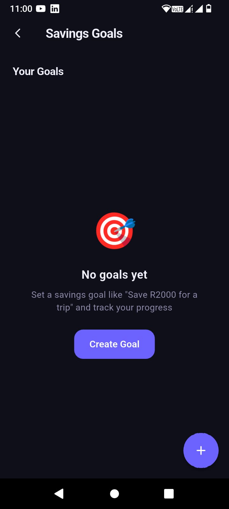

### Settings
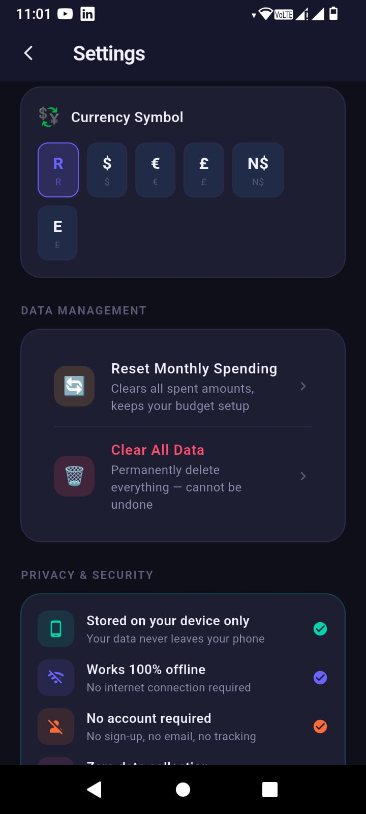

---

## ⚙️ Getting Started

### Prerequisites
- Flutter SDK installed
- Android Studio / VS Code

### Run the App

```bash
git clone https://github.com/pulemojatau/budget-app.git
cd budget-app
flutter pub get
flutter run
```

### 📦 Build APK / AAB

```bash
flutter build apk
# or
flutter build appbundle
```

---

## 🔐 Privacy

- No user data is collected
- No tracking or analytics
- No internet connection required
- All data is stored locally on the device

---

## 🧪 Current Status

- ✅ Fully functional MVP
- ✅ Offline-first
- ✅ Production-ready UI
- 🔄 Currently testing & refining based on real usage

---

## 🔮 Future Improvements

- Quick-add spending from dashboard
- Monthly summary insights
- Budget carry-over between months
- Data backup & restore
- Export reports

---

## 💼 Portfolio Context

This project was built as part of my journey to move from learning development to building real, usable products.

It focuses on:

- Clean architecture
- Real-world problem solving
- User-centered design
- Practical functionality over complexity

---

## 👨‍💻 Author

**Motlalepula Mojatau** — Software Developer

- GitHub: [pulemojatau](https://github.com/pulemojatau)
- Portfolio: [website](https://motlalepula-mojatau-portfolio-website.vercel.app)
